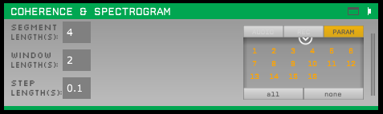
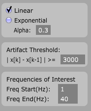
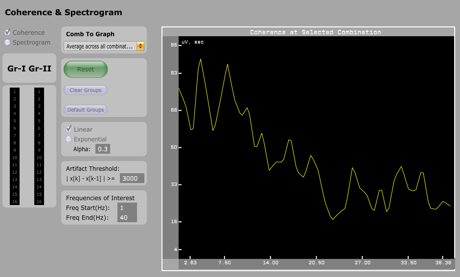

# Coherence & Spectrogram Viewer
Coherence & Spectrogram Viewer, is a plugin which can be used to analyze real time data with Open Ephys. As the name suggest serves two function, First, it estimates coherence between two group of channels See [video](https://drive.google.com/open?id=1Qn3aU0Fl4xd-TCFRlrGKvbNjoVNFkC9a).. Second, it shows spectrogram specifically the plot of power vs frequency (Power over time is averaged).

----
### Walk through:
One can install plugin with the open Ephys as described in the installation module. Once the plugin installation is done, user has to define parameter for Time-Frequency Response calculation. This can be viewed in the coherence & spectrogram window as shown below

  

>Segment Length: Segment length is the size of trial length / the past data to look for while calculating TFR.

>Window Length:Window Length is the length of wavelet to be used for the calculation.

>Step Length:Step size is the time with which a wavelet to travel through the segment to calculate TFR.

>PARAM: Number of active channels in the system.

The visualizer for the plugin:

By Default, Visualizer is set for Coherence calculation. This can be changed to spectrogram using toggle button with right tick on it. One should remember coherence and Spectrogram are two mutually exclusive modules and cannot be viewed at the same time within the current setting of the code. Group I and Group II which is present on the left hand side of the plot appears once a source of data is selected from the “SOURCES”

Group I(Gr-I) & Group II(Gr-II) shows the active number of channels. By default, first half of the channels are selected for Group I and other half for Group II. This can be changed as per the individual scenario requirement as show in the adjacent fig. One can choose not to select a channel to calculate coherence, but in order to calculate coherence there should be at least one channel selected in each group at all time.

  

This selection of channels populates the drop down box as shown in the adjacent figure. The example shows two possible option in a scenario. 1x16 and 2x16 which is of the form G1 x G2 i.e. channel 1 and 2 are from G1 and 16 from G2.

  

| Button           	| Description                                                                                                                                                                         	|
|------------------	|-------------------------------------------------------------------------------------------------------------------------------------------------------------------------------------	|
| Reset            	| Resets TFR data.Needs to be clicked if any parameter is changed.This starts recalculating TFR based on current data available. Red Colour: User needs to click the button for reset 	|
| Clear Groups     	| Clear all the selected channels                                                                                                                                                     	|
| Default   Groups 	| Change the selection to default group                                                                                                                                               	|

  

|    Options               	|    Description                                                                                            	|
|--------------------------	|-----------------------------------------------------------------------------------------------------------	|
|    Linear                	|    Calculate coherence   based on past giving it linear importance                                        	|
|    Exponential           	|    Calculate coherence   based on past giving it exponential decay important further is less important    	|
|    Artifact Threshold    	|    Any value above 3000   Micro-volt will be detected as artifact and deleted from TFR calculation.       	|

One can start acquisition. The coherence will be shown on the plot. If one wishes to view spectrogram plot. Click on spectrogram option and hit acquisition button. Plots will be displayed based on the current active channels.

----
### Coherence 
For an input shown below

Average across all combination looks like

----
### Spectrogram 
For an input of Sine wave 

One can see the power in the corresponding frequency

----
## Installation
This plugin must now be built outside of the main GUI file tree using CMake. In order to do so, it must be in a sibling directory to plugin-GUI\\ and the main GUI must have already been compiled using cmake. *The coherence-viewer folder should be the sibling directory.*

You must also first install the "OpenEphysFFTW" common library, available [here](https://github.com/tne-lab/OpenEphysFFTW/tree/master). *You must build the install project in the solution.*

See `CoherenceViewer/CMAKE_README.txt` and/or the wiki page [here](https://open-ephys.atlassian.net/wiki/spaces/OEW/pages/1259110401/Plugin+CMake+Builds) for build instructions.

If you have the GUI built somewhere else, you can specify its location by setting the environment variable `GUI_BASE_DIR` or defining it when calling cmake with the option `-DGUI_BASE_DIR=<location>`.

----
### Development
Note this plugin is still in active development. If you have more ideas for the development of the plugin. Feel free to Contact us on 
<markschatza@gmail.com>
<sumedh7.nagrale@gmail.com>

